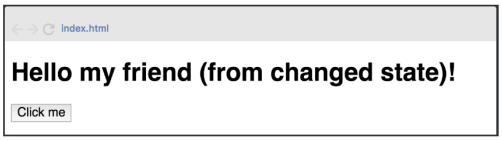

# Trabajo Práctico de React
## Ejercicio 3 - Hello world (parte 3)

Modificar el programa anterior agregando al componente un state con la clave msj:
“(from changed state)”, además agregar un botón al presionar este botón (onClick),
el state de la clave msj se debe mostrar por pantalla de la siguiente manera:

## Repositorio GitHub

## Deploy

## Autor

**Mendoza, Mariana Eugenia** 😃

## Herramientas Utilizadas 🛠️

- HTML
- CSS 
- Bootstrap 5.3.3
- JavaScript
- GIT y GitHub
- React
